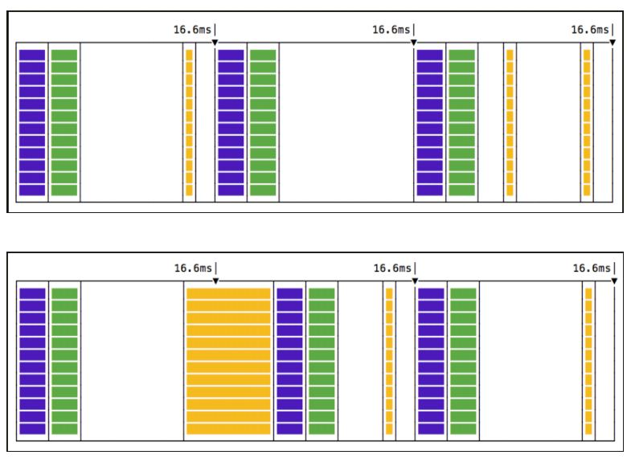
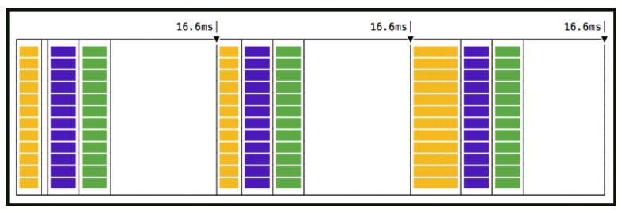

# requestAnimationFrame

## 동현

### requestAnimationFrame의 특징

보통 애니메이션 최적화를 위해 사용하는 window 객체의 메서드입니다. 1초당 60번정도만 실행되는데, 사실상 이 수치보다 더 빈번하게 화면을 다시 그리더라도 사람들이 더 좋은 애니메이션이라고 느끼지 못한다고 합니다. 따라서 가장 최적의 빈도수로 명령을 수행하도록 돕습니다. (setInterval로 하면 60번보다 많은 callstack이 쌓일 수 있는데 무의미한 코드만 쌓이게 되는 것입니다.)

또한, 똑같이 setInterval로 1초에 60번정도 애니메이션 코드를 실행시키는 것에 비교해서 훨씬 부드러운 동작을 보장합니다. requestAnimationFrame을 사용하면 함수에 인자로 넘긴 콜백함수가 repaint가 일어나기 직전에 실행되어 한 프레임 내에 자연스러운 리렌더링이 보장되기 때문입니다. setInterval은 프레임을 신경쓰지 않고 해당 명령이 실행되기 때문에, 렌더링이 지연되거나 js코드가 블로킹 될 수 있습니다. 따라서 프레임 유실이 발생하기도 하는 등 뚝뚝 끊기는 현상이 발생할 수 있습니다.

또한, 페이지가 비활성화 상태인 경우 requestAnimationFrame도 일시정지 됩니다. 따라서, 리소스를 낭비하지 않게 됩니다.

위: setInterval등을 사용한 비효율적인 방식
아래: requestAnimationFrame을 사용한 프레임 간격 내에서의 리렌더링 보장

### 참고 자료

- [requestAnimationFrame 활용하기](https://simsimjae.tistory.com/402)
- [도움이 된 requestAnimationFrame 글](https://velog.io/@0715yk/HTML-requestAnimationFrame#:~:text=%ED%95%A0%20%EC%88%98%20%EC%9E%88%EB%8B%A4.-,requestAnimationFrame%EC%9D%98%20%EC%9B%90%EB%A6%AC,%EB%A6%AC%EB%A0%8C%EB%8D%94%EB%A7%81%EC%9D%84%20%ED%95%98%EA%B2%8C%EB%90%9C%EB%8B%A4.)